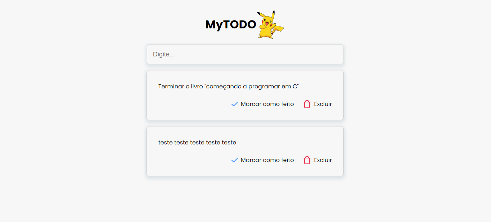

<h1 align="center">
  MyTODO
</h1>

<p align="center">
 

  
</p>

## Tecnologias

*frontend*
- ReactJS
- Sass
- Typescript
- Axios
- Vite

*backend*
- Python
- django 4
- sqlite
- django-rest-framework


</br>

### Como rodar o projeto

### 🎲 Rodando o Back End (servidor)

```bash
# Acesse a pasta do projeto no terminal/cmd
$ cd MyTodo

# Vá para a pasta backend
$ cd backend

# Instalar bibliotecas, instalar requerimentos
$ (env) pip install django
$ (env) pip freeze > requirements.txt
$ (env) pip install -r requirements.txt


## Comandos: criar e ativar o ambiente virtual
# Criar (windows) 
python -m venv venv

# Ativar (windows)
$ venv\Scripts\Activate

# Rodar o servidor
$ python manage.py runserver

```

### 🎲 Rodando o Front End

```bash

# Vá para a pasta frontend
$ cd frontend

# Instale as dependências
$ npm install

# Execute a aplicação em modo de desenvolvimento
$ npm run dev

```

</br>

<h1 align="center"> 
	Projeto
</h1>

<h1 align="center">

</h1>
